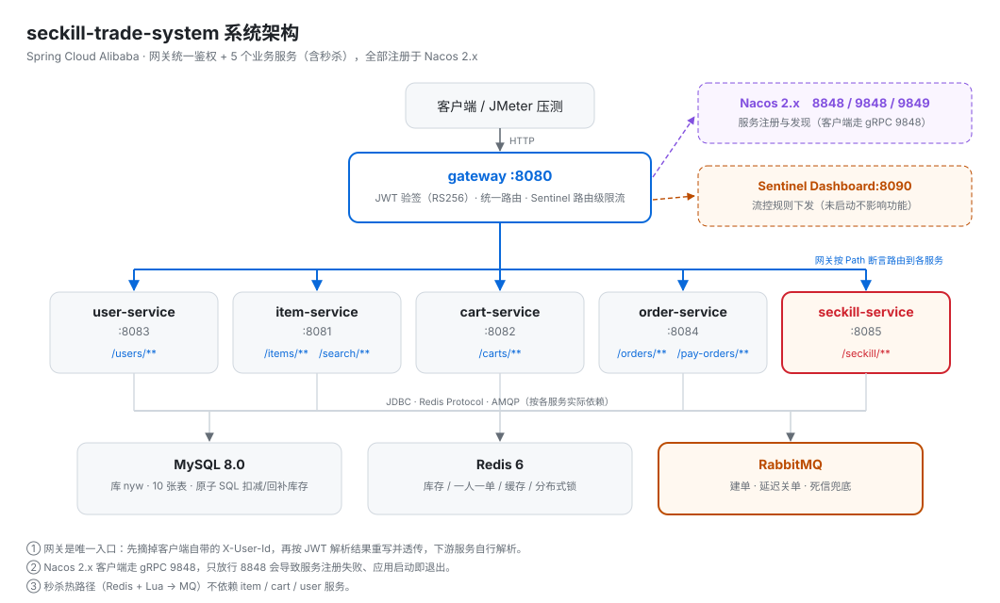
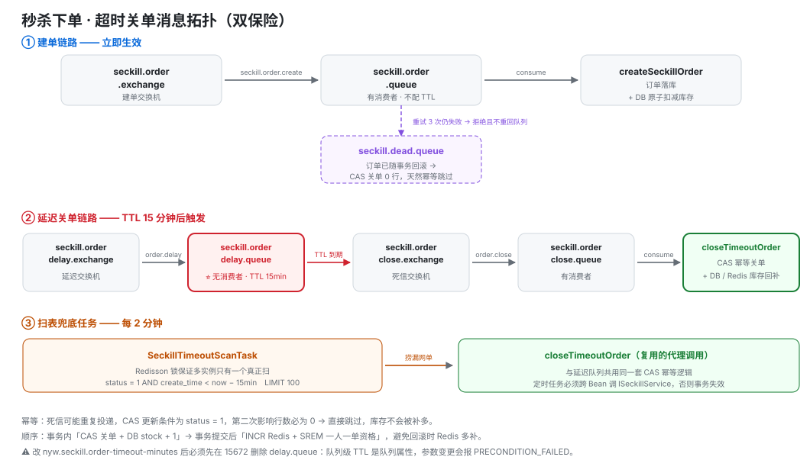
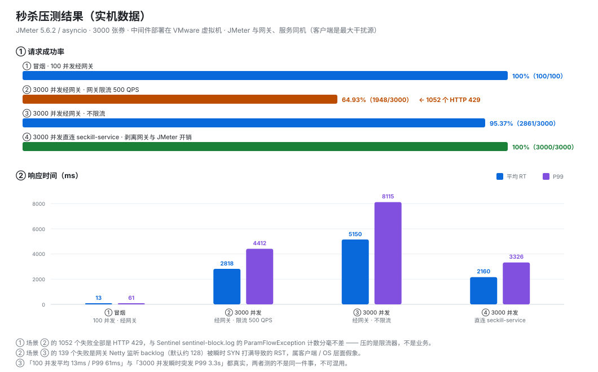
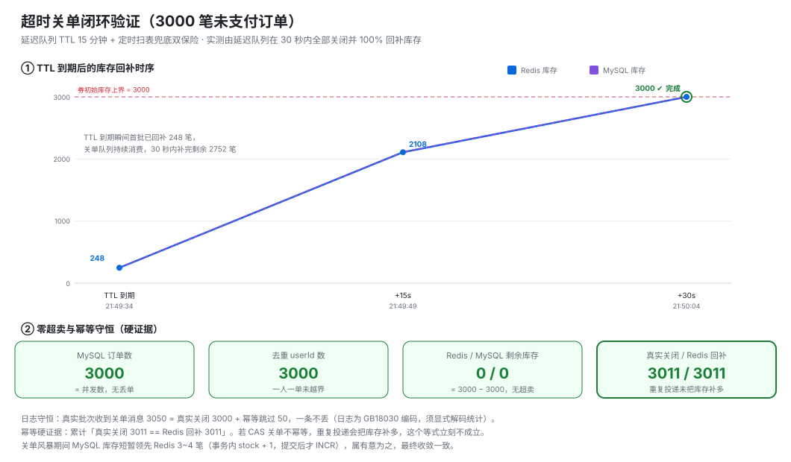

# seckill-trade-system · 高并发秒杀交易系统

基于 **Spring Cloud Alibaba** 的微服务电商交易系统，核心是高并发秒杀场景下的
**零超卖下单** 与 **超时未支付自动关单**。

> 项目在 Redis + Lua 原子脚本、RabbitMQ 延迟队列/死信交换机、CAS 幂等关单三条主线上做了完整实现，
> 并在真实中间件 + 真实服务上跑通了可复现的端到端验证（见 [§6 验证与压测结果](#6-验证与压测结果)）。

---

## 1. 技术栈

| 分类 | 选型 |
|---|---|
| 基础框架 | Spring Boot 2.7.12 / Spring Cloud 2021.0.3 / Spring Cloud Alibaba 2021.0.4.0 |
| 注册中心 · 配置 | Nacos 2.x（含 gRPC 端口 9848/9849） |
| 网关 | Spring Cloud Gateway + Sentinel（路由级 QPS 限流） |
| 服务调用 | OpenFeign + Spring Cloud LoadBalancer |
| 持久层 | MyBatis-Plus 3.5.3.1 + MySQL 8.0.23 |
| 缓存 | Redis 6 + Lettuce 连接池 + Redisson 3.17.7（分布式锁） |
| 消息队列 | RabbitMQ（延迟队列 TTL + 死信交换机 + 手动拒绝不重回队列） |
| 鉴权 | RS256 JWT（hutool-jwt），网关统一验签并向下游透传身份 |
| 接口文档 | knife4j-openapi3（springdoc-openapi 1.7.0，非 jakarta 版） |
| 构建 | Maven 3.9 + JDK 11（编译级别） |

## 2. 系统架构



### 模块说明

| 模块目录 | artifactId | 端口 | 职责 |
|---|---|---|---|
| `nyw-common` | `nyw-common` | — | 公共层：统一返回体、全局异常、缓存服务、分布式 ID、Redis Key 规范；通过 `META-INF/spring.factories` 向各服务注入公共 Bean |
| `nyw-api` | `nyw-api` | — | Feign 客户端与跨服务 DTO 定义 |
| `gateway` | `gateway` | 8080 | 统一入口：路由转发、JWT 鉴权、CORS、Sentinel 网关流控 |
| `item-service` | `item-service` | 8081 | 商品：详情/分页/搜索，Cache-Aside 缓存与库存扣减 |
| `cat-service` | `cart-service` | 8082 | 购物车 |
| `user-service` | `user-service` | 8083 | 用户：登录签发 JWT、余额扣减 |
| `order-service` | `order-service` | 8084 | 普通订单与支付单 |
| `seckill-service` | `seckill-service` | 8085 | **核心**：秒杀下单、热点预热、异步建单、延迟关单、扫表兜底 |

> 注意：`cat-service` 是目录名，其 `artifactId` 与 Nacos 服务名均为 `cart-service`。

## 3. 秒杀核心链路

### 3.1 下单主流程

```
POST /seckill/{voucherId}
   │
   ├─ ① 校验收参：券存在 / 在活动时间窗内 / 已登录（UserContext）
   ├─ ② 生成分布式订单 ID      (秒级时间戳 << 32 | Redis INCR 序列号)
   ├─ ③ 执行 Lua 脚本【原子】：一人一单校验 → 库存校验 → DECR 库存 → SADD 已购集合
   ├─ ④ Redisson 互斥锁保护消息投递
   ├─ ⑤ 投递建单消息 → seckill.order.queue   （立即被消费，落库）
   └─ ⑥ 投递延迟消息 → seckill.order.delay.queue（躺 TTL，到期触发关单）
   │
   └─ 返回 orderId（异步，HTTP 只负责"抢到资格"）
```

Lua 脚本 `seckill-service/src/main/resources/lua/seckill.lua` 是整个防超卖的第一道闸：

```lua
-- KEYS[1]=库存key  KEYS[2]=已下单用户集合key  ARGV[1]=userId
-- 返回值: 0=成功, 1=库存不足, 2=用户已下单
local isMember = redis.call('sismember', KEYS[2], ARGV[1])
if isMember == 1 then return 2 end
local stock = redis.call('get', KEYS[1])
if not stock or tonumber(stock) <= 0 then return 1 end
redis.call('decr', KEYS[1])
redis.call('sadd', KEYS[2], ARGV[1])
return 0
```

「校验 + 扣减 + 记录」三步在 Redis 单线程内一次完成，不存在检查与扣减之间的时间窗。

### 3.2 超时未支付自动关单（双保险）



| 通道 | 触发方式 | 定位 |
|---|---|---|
| **方案 A**：延迟队列 | 队列级 TTL（`x-message-ttl`）到期 → DLX 转投关单队列 | 实时关单，精确到秒 |
| **方案 B**：扫表兜底 | `@Scheduled` 每 2 分钟扫 `status=1 AND create_time < now-15min` | 捞漏网单：延迟消息丢失、消费者重试耗尽、停机期间到期、历史脏数据 |

两个容易被追问的设计点：

1. **延迟队列必须无消费者**。消息被消费成功即 ack 删除，根本躺不满 TTL，永远进不了死信交换机 —— 这是「15 分钟自动关单只写在配置里、实际从未生效」的经典原因。
2. **用队列级 TTL，不用消息级 TTL**。队列级 TTL 的到期顺序等于入队顺序；消息级 TTL 会被队头那条未过期的消息阻塞，后面已到期的也只能干等。

### 3.3 幂等设计（关单链路）

死信消息可能被重复投递，也可能与扫表任务同时命中同一笔订单，因此关单是**三步全幂等**：

```java
// SeckillServiceImpl#closeTimeoutOrder —— @Transactional
int rows = seckillOrderMapper.closeIfUnpaid(orderId);   // UPDATE ... SET status=3 WHERE id=? AND status=1
if (rows == 0) return;                                   // ① CAS：影响 0 行 → 已支付/已关闭 → 直接跳过
voucherMapper.restoreStock(voucherId);                   // ② DB 库存原子回补 stock = stock + 1
runAfterCommit(() -> {                                   // ③ 事务提交后再回补 Redis
    redis.increment(stockKey);
    redis.remove(orderSetKey, userId);                   //    释放一人一单资格
});
```

第 ① 步的 CAS 是幂等的关键：只有 `status=1` 能被关闭，重复投递第二次必然影响 0 行，库存不会被补多。
第 ③ 步放在 `afterCommit`，是为了避免「DB 回滚了、Redis 却已经多补」的脏数据；代价是关单瞬间 DB 库存会短暂领先 Redis 个位数，最终收敛。

### 3.4 其他关键实现

| 主题 | 实现位置 | 要点 |
|---|---|---|
| 分布式 ID | `nyw-common/.../DistributedIdGenerator.java` | `(秒级时间戳 << 32) \| (Redis INCR & 0xFFFFFFFFL)`，19 位、趋势递增、`BIGINT` 安全 |
| 热点预热 | `SeckillServiceImpl#scheduledPreheat` | 每分钟预热「进行中 + 未来 30 分钟」场次；库存用 `setIfAbsent` 避免把活动中的库存重置回初始值；商品一次 Feign 批量查回填，TTL 覆盖到活动结束后 10 分钟并加随机抖动 |
| 缓存三防 | `nyw-common/.../cache/CacheServiceImpl.java` | 空值缓存防穿透 / 互斥锁防击穿 / 逻辑过期防击穿 / 随机 TTL（80%~120%）防雪崩 |
| 缓存一致性 | `ItemServiceImpl` | Cache-Aside：`updateById`/`removeById`/`deductStock` 写成功后主动失效缓存 |
| 网关鉴权 | `gateway/.../filter/AuthGlobalFilter.java` | **第一步无条件摘掉客户端自带的 `X-User-Id`**，再按 token 解析结果重写；否则白名单路径可伪造身份越权 |
| 身份透传 | `UserInfoInterceptor` + `UserContext` | 微服务自行解析网关透传的 `X-User-Id`，请求结束必须 `removeUser()`（Tomcat 线程复用会串号） |
| 网关限流 | `gateway/.../config/GatewaySentinelConfig.java` | 按路由 ID 限流：`seckill-service` 500 QPS、`order-service` 200 QPS，阈值走配置便于把「限流保护」与「业务不超卖」分开验证 |

## 4. 快速开始

### 4.1 环境要求

| 组件 | 版本 | 说明 |
|---|---|---|
| JDK | 11+ | 编译级别 11，实测 JDK 17 运行正常 |
| Maven | 3.8+ | |
| MySQL | 8.0 | 库名 `nyw` |
| Redis | 6+ | |
| RabbitMQ | 3.9+ | 需管理插件（15672） |
| Nacos | **2.x** | ⚠️ 必须同时放行 **8848 + 9848 + 9849** |

> ⚠️ **Nacos 是硬依赖**：`NacosServiceRegistry.register()` 抛异常会冒泡成
> `Failed to start bean 'webServerStartStop'`，应用直接退出（不是降级可用）。
> Nacos 2.x 客户端走 gRPC **9848**，只映射 8848 一定失败：
>
> ```bash
> docker run -d --name nacos -p 8848:8848 -p 9848:9848 -p 9849:9849 \
>   -e MODE=standalone nacos/nacos-server:v2.1.0-slim
> ```

### 4.2 数据库

完整建表脚本：`sql/schema.sql`（10 张表，从实际运行库导出，含索引与注释）。

```bash
mysql -h <host> -u root -p nyw < sql/schema.sql
```

| 文件 | 内容 |
|---|---|
| `sql/schema.sql` | 全库结构：`item` / `cart` / `user` / `address` / `order` / `order_detail` / `order_logistics` / `pay_order` / `seckill_voucher` / `seckill_order` + 演示用秒杀券 |
| `sql/seckill-tables.sql` | 只含秒杀两张表与索引，用于在既有库上增量补充（可重复执行） |

> `seckill_order` 上的 `idx_status_create_time (status, create_time)` 是扫表兜底关单的**必需索引**：
> 查询条件是 `status = 1 AND create_time < ?`，等值列在前、范围列在后，可同时吃到过滤与排序。

### 4.3 配置

各服务配置集中在 `{module}/src/main/resources/application.yaml`，需要按自己的环境调整：

| 配置项 | 位置 | 说明 |
|---|---|---|
| `spring.cloud.nacos.server-addr` | 全部服务 | Nacos 地址 |
| `spring.datasource.*` | 除 gateway 外 | MySQL 地址与库 `nyw` |
| `spring.redis.*` | item / cart / user / order / seckill | Redis 地址与密码 |
| `spring.rabbitmq.*` | seckill | RabbitMQ 连接 |
| `nyw.seckill.order-timeout-minutes` | seckill | 订单超时分钟数，**延迟队列 TTL 与扫表阈值共用**，联调可压成 1 |
| `nyw.seckill.preheat-cron` | seckill | 热点预热 cron（默认 `0 * * * * ?`，每分钟） |
| `nyw.seckill.close-scan-cron` | seckill | 扫表兜底 cron（默认 `0 */2 * * * ?`，每 2 分钟） |
| `nyw.gateway.flow.seckill-qps` / `order-qps` | gateway | 网关路由限流阈值 |
| `hm.jwt.location` / `alias` / `password` | gateway / user | JWT 密钥库（RS256），**只有这两个服务加载 keystore，三处配置必须自洽** |

所有配置项均可用环境变量覆盖，例如
`NYW_SECKILL_ORDER_TIMEOUT_MINUTES=1`、`NYW_SECKILL_CLOSE_SCAN_CRON="0/20 * * * * ?"`。

> 注意 `@Scheduled` 的 cron 必须是**6 段**（秒 分 时 日 月 周）。写成 5 段会在启动时抛
> `IllegalStateException: Cron expression must consist of 6 fields`，服务起不来。

### 4.4 构建与启动

```bash
# 构建（首次务必 clean，避免陈旧 class 残留）
mvn -DskipTests clean install

# 启动顺序建议：Nacos → 各业务服务 → gateway 最后
java -jar seckill-service/target/seckill-service.jar
# 或直接在 IDE 中运行各模块的 XxxApplication
```

启动后：

- 接口文档：`http://localhost:{port}/doc.html`（knife4j）
- RabbitMQ 控制台：`http://{mq-host}:15672`
- 关闭 `logging.level.com.nyw: debug` 可显著降低压测时的磁盘 I/O 干扰

> 修改 `nyw.seckill.order-timeout-minutes` 后，必须先在 RabbitMQ 控制台删除
> `seckill.order.delay.queue` 再重启：队列级 TTL 是**队列属性**，参数变更会报
> `PRECONDITION_FAILED - inequivalent arg 'x-message-ttl'`。

## 5. 接口清单

| 服务 | 方法 | 路径 | 说明 |
|---|---|---|---|
| gateway | — | `:8080` | 所有请求的统一入口 |
| user | POST | `/users/login` | 登录，返回 RS256 JWT |
| user | PUT | `/users/money/deduct/{userId}` | 扣减余额 |
| item | GET | `/items/{id}` | 商品详情（走缓存） |
| item | GET | `/items/page` · `/items` | 分页 / 批量查询 |
| item | GET | `/items/search` · `/search/list` | 商品搜索 |
| item | PUT | `/items/stock/deduct` | 扣减商品库存（供订单服务调用） |
| cart | GET/POST/PUT/DELETE | `/carts` | 购物车增删改查 |
| order | POST | `/orders` | 创建普通订单 |
| order | GET | `/orders/{id}` | 订单详情 |
| pay | POST | `/pay-orders` | 申请支付单 |
| **seckill** | **POST** | **`/seckill/{voucherId}`** | **秒杀下单（核心接口）** |
| seckill | POST | `/seckill/preheat` | 批量预热「进行中 + 未来 30 分钟」场次 |
| seckill | POST | `/seckill/preheat/{voucherId}` | 预热单场（库存 + 关联商品） |
| seckill | POST | `/seckill/init-stock/{voucherId}` | 初始化秒杀库存（兼容旧接口，内部委托预热） |
| seckill | GET | `/seckill/item/{itemId}` | 查询秒杀热点商品（优先读预热缓存） |

> 请求 `POST /seckill/{voucherId}` 需要携带登录后的 JWT（`Authorization` 头，**裸 token，不带 `Bearer ` 前缀**），
> 由网关验签后把 `userId` 写入 `X-User-Id` 透传给 `seckill-service`。

## 6. 验证与压测结果

### 6.1 秒杀并发与零超卖



| 场景 | 并发 | 成功/总数 | 成功率 | RT 平均 / P50 / P99 |
|---|---|---|---|---|
| JMeter 冒烟（经网关） | 100 | 100/100 | 100% | **13 / 12 / 61 ms** |
| JMeter 同步释放（经网关，500 QPS 限流开启） | 3000 | 1948/3000 | 64.93% | 2818 / 2883 / 4412 ms |
| asyncio 直连 seckill-service | 3000 | **3000/3000** | **100%** | 2160 / 2112 / 3326 ms（717 req/s） |

**零超卖验收（直连 3000 并发，全部成功）**：

| 检查项 | 实测 | 结果 |
|---|---|---|
| MySQL 订单数 | 3000 | PASS |
| 去重 userId 数 | 3000 | PASS |
| Redis 剩余库存 | 0 = 3000 − 3000 | PASS |
| MySQL 剩余库存 | 0 | PASS |
| `order:set` 基数（一人一单） | 3000 | PASS |

> 限流场景的 1052 个失败全部是 HTTP 429，与 Sentinel `sentinel-block.log` 中
> `ParamFlowException` 的计数分毫不差；这说明压的是限流器，不是业务。

### 6.2 超时关单闭环



TTL 到期后 **3000 笔未支付订单在约 30 秒内全部关闭（`status 1 → 3`），库存 100% 回补**：

| 时刻 | Redis 库存 | MySQL 库存 | `order:set` | 已关闭订单 |
|---|---|---|---|---|
| TTL 到期前 | 0 | 0 | 3000 | 0 |
| TTL 到期 + 15s | 2108 | 2112 | 892 | 2112 |
| 完成后 | **3000** | **3000** | **0** | **3000** |

日志侧守恒校验（按 GB18030 解码统计）：

| 批次 | 收到关单消息 | 真实关闭 | 幂等跳过 |
|---|---|---|---|
| 本次真实批次 | 3050 | 3000 | 50 |
| 累计 | 8079 | **3011** | 5071 |

`真实关闭 3011 == Redis 回补 3011` —— 若 CAS 幂等失效，重复投递会把库存补多，这个等式立刻不成立。

### 6.3 端到端断言

在真实中间件 + 真实服务上跑通 **24 项端到端断言**，覆盖：
下单 → 延迟关单 → 重复投递幂等 → 已支付订单不被误关 → 扫表兜底 → 多实例定时任务互斥 → 日志守恒。

### 6.4 复现方式

验证脚本与压测工具链以**脱敏副本**形式随仓库提供，见 [`publish/test/`](publish/test/)：

```bash
# 不启动服务，直打真实中间件（Redis + Lua 并发 / SQL 幂等 / MQ 拓扑），12 项断言
python publish/test/verify-infra.py

# 启动服务后的 24 项端到端断言（约 90 秒）
python publish/test/e2e/verify-seckill-e2e.py

# 压测：复位数据 → 冒烟 → 全量 3000 并发 → 验收
python publish/test/jmeter/prepare-seckill-loadtest.py --stock 3000
python publish/test/jmeter/run-jmeter.py --jmx seckill-3000-concurrent.jmx --tag full3000
python publish/test/jmeter/verify-seckill-loadtest.py --jtl .../result.jtl --expect 3000 --stock 3000

# 延迟关单观测 + 日志守恒校验
python publish/test/jmeter/watch-delayed-close.py --minutes 20
python publish/test/jmeter/analyze-seckill-log.py
```

> 脚本中的主机、密码、本机工具路径已替换为 `${MW_HOST}` / `${MW_PASSWORD}` 等占位符，运行前需自行替换。
> `jmeter/data/seckill-users.csv`（3000 个真实 JWT）**未随仓库提供**，可用 `jmeter/tools/TokenGen.java` 现场生成。
> 细节与完整清单见 [`publish/test/README.md`](publish/test/README.md)。

> ⚠️ 日志文件是 **GB18030** 编码。Git-Bash 的 `grep` / `rg` 在 `LANG=C.UTF-8` 下匹配不到任何中文且**静默返回 0**，
> 会得出「关单从未发生」这类错误结论 —— 中文统计一律走 `analyze-seckill-log.py`。

## 7. 目录结构

```
seckill-trade-system/
├── pom.xml                  # 聚合 POM，groupId com.nyw
├── sql/
│   ├── schema.sql           # 全库结构（10 张表，从实际运行库导出）
│   └── seckill-tables.sql   # 秒杀两张表增量脚本（可重复执行）
├── docs/images/             # README 引用的架构图与压测结果图（静态 SVG，无需插件即可渲染）
├── publish/test/            # 验证脚本与报告的脱敏副本（可直接复现压测）
├── nyw-common/              # 公共层：缓存 / 异常 / 统一返回 / 分布式 ID / Redis Key 规范
├── nyw-api/                 # Feign 客户端与跨服务 DTO
├── gateway/                 # 网关：路由 + JWT 鉴权 + Sentinel 流控
├── item-service/            # 商品服务（8081）
├── cat-service/             # 购物车服务（8082，artifactId = cart-service）
├── user-service/            # 用户服务（8083）
├── order-service/           # 订单服务（8084）
└── seckill-service/         # 秒杀服务（8085）
    └── src/main/resources/lua/seckill.lua   # 原子扣减脚本
```

Redis Key 规范统一收敛在 `nyw-common/.../RedisKeyConstants.java`，格式 `nyw:{模块}:{类型}:{标识}`，
例如 `nyw:seckill:stock:{voucherId}`、`nyw:seckill:order:set:{voucherId}`。

## 8. 已知限制与后续优化

按收益排序，均为**尚未实施**项：

1. **压测机与被测服务未分离** —— 当前 JMeter、网关、业务服务、中间件 VM 全在同一台机器上，
   3000 并发时的 P99 主要反映客户端资源竞争，不代表服务端容量，需独立压测机复测。
2. **扫表兜底吞吐上限约 50 单/分钟**（单轮 `LIMIT 100`、2 分钟一轮、无内层循环）。
   延迟队列正常时够用，一旦方案 A 整体失效，3000 单需近 1 小时才能消化；
   建议批量提到 500~1000 或单轮循环捞到空（注意同步调整锁租约）。
3. **连接池与日志级别未按并发调优** —— HikariCP 默认 10、Lettuce `max-active: 16`、
   网关 HttpClient 池默认 500；压测时 `logging.level.com.nyw` 仍是 `debug`。
4. **网关 Netty 监听 backlog 未调**（默认约 128），瞬时 SYN 洪峰下会 RST 掉少量连接。
5. **`seckillVoucher` 每单查一次 DB**，可预热进 Redis 砍掉一次往返。
6. **安全项**：仓库内的 `application.yaml` 含本地联调用的内网地址与演示凭据，
   `nyw.jks` 为自签演示密钥库；正式环境需全部替换为环境变量注入。

## 9. 作者

**牛压文** · 2027 届 Java 后端方向
GitHub: [@nyw-source](https://github.com/nyw-source)
